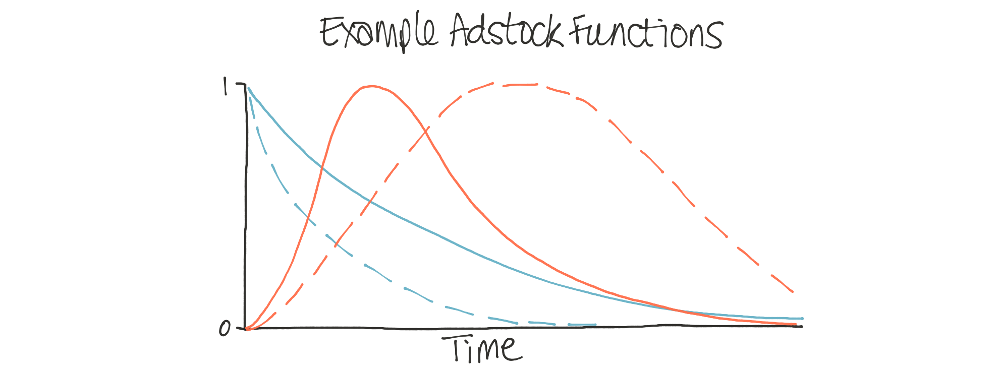
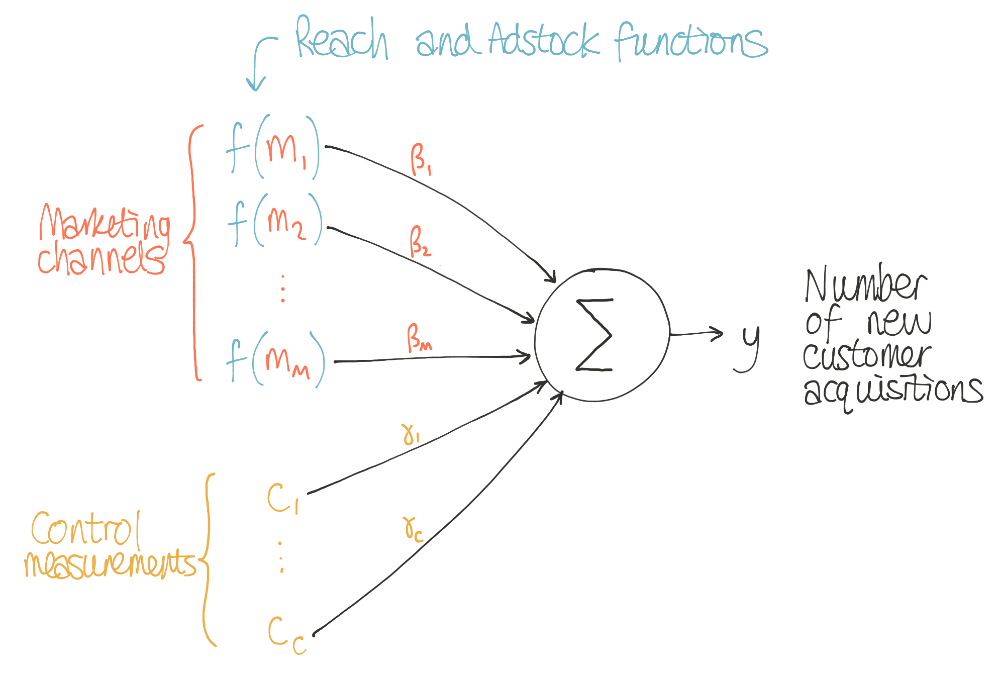

# Introduction to Media Mix Modeling

A problem faced by many companies is how to allocate marketing budgets across different media channels. For example, how should funds be allocated across TV, radio, social media, direct mail, or daily deals?

One approach might be to use heuristics, i.e. sensible rules of thumb, about what might be most appropriate for your company. For instance, a widely used approach is to simply set your marketing budget as a percentage of expected revenues. But this involves guesswork - something we want to avoid regardless of the size of the marketing budget involved.

Fortunately, with Bayesian modeling, we can do better than this! So-called Media Mix Modeling (MMM) can estimate how effective each advertising channel is in driving our outcome measure of interest, whether that is sales, new customer acquisitions, or any other key performance indicator (KPI). Once we have estimated each channel's effectiveness we can optimize our budget allocation to maximize our KPI.

## What can you do with Media Mix Modeling?

Media Mix Modeling (MMM) is a powerful tool that provides actionable insights for businesses. Here are some key ways you can leverage MMM to drive strategic decisions and improve your marketing ROI:

1. Understand the effectiveness of different media channels in driving customer acquisition. Not only can you learn from data about the most influential media channels for your business, but you can update this understanding over time. By incorporating new marketing and customer acquisition data on an ongoing basis, you can learn about the changing effectiveness of each channel over time.

2. Optimize Budget Allocation: Use MMM to determine the most effective distribution of your marketing budget across different channels. By understanding the impact of each channel on your KPIs, you can allocate resources where they'll generate the highest return.

3. Enhance ROI Forecasting: Develop more accurate forecasts of expected returns for different marketing scenarios. This allows you to set realistic goals and make data-driven decisions about future campaigns.

4. Identify Synergies Between Channels: Uncover how different marketing channels interact and complement each other. This insight can help you create more cohesive, integrated marketing strategies that leverage cross-channel effects.

5. Adapt to Market Changes: Continuously update your model with new data to track changes in channel effectiveness over time. This allows you to quickly adapt your strategy to evolving market conditions, consumer behaviors, or competitive landscapes.

6. Justify Marketing Investments: Use concrete data to demonstrate the value of marketing activities to stakeholders. MMM provides a quantitative basis for marketing budget discussions and helps align marketing goals with overall business objectives.

7. Optimize Timing and Frequency: Determine the optimal timing and frequency of your marketing efforts across different channels. This can help you avoid oversaturation and maximize the impact of your campaigns.

8. Scenario Planning: Run "what-if" analyses to evaluate potential outcomes of different marketing strategies before implementing them. This can help mitigate risks and identify the most promising opportunities.

9. Personalize Marketing Strategies: Use insights from MMM to tailor your marketing approach for different customer segments or geographic regions, maximizing relevance and effectiveness.

10. Benchmark Performance: Compare your marketing performance against industry standards or historical data to identify areas for improvement and set competitive targets.

11. Guide Long-term Strategy: Use MMM insights to inform long-term marketing and business strategies, ensuring that your marketing efforts align with and support your company's broader goals and vision.

By leveraging these actionable insights from Media Mix Modeling, businesses can make more informed, data-driven decisions that lead to improved marketing effectiveness, increased ROI, and sustainable growth.

## Brief history of Media Mix Models

Media Mix Models (MMMs) have a rich history dating back to the 1950s and 1960s when they were first developed by marketing pioneers. Here's a brief overview of their evolution:

1. 1950s-1960s: The concept of MMMs emerged as marketers sought to quantify the impact of different advertising channels on sales.

2. 1970s-1980s: With the advent of more sophisticated statistical techniques and computing power, MMMs became more widespread in the advertising industry.

3. 1990s: The rise of scanner data and loyalty card programs provided more granular data, allowing for more detailed and accurate models.

4. 2000s: The digital revolution introduced new challenges and opportunities. MMMs had to adapt to incorporate digital channels and deal with the increased complexity of the media landscape.

5. 2010s: Big data and machine learning techniques began to be incorporated into MMMs, allowing for more complex models and real-time optimization.

6. Present day: Modern Bayesian approaches, like those used in PyMC-Marketing. These offer several advantages, including the ability to incorporate prior knowledge, handle uncertainty more robustly, calibrate the models through lift tests, and provide more interpretable results.

Throughout this evolution, the core goal of MMMs has remained the same: to help marketers understand and optimize the effectiveness of their marketing spend across different channels. As the media landscape continues to evolve, so too will the techniques and applications of Media Mix Modeling.

## How does Media Mix Modeling work?

In simple terms, we can understand MMMs as regression modeling applied to business data. The goal is to estimate the impact of marketing activities and other drivers on a metric of interest, such as the number of new customers per week.

To do this, we use two main types of predictor variables:

1. The level of spend for each media channel over time.

2. A set of control measurements that could capture seasonality or economic indicators.
The basic approach to MMMs uses linear regression to estimate a set of coefficients for the relative importance of each of these predictors, but real-world MMMs commonly incorporate also non-linear factors to more accurately capture the effect of marketing activities on consumer behaviour:

### The reach (or saturation) function

Rather than model our KPI as a linear function of marketing spend, the reach function models the potential saturation of different channels: While the initial money spent on an advertising channel might have a big impact on customer acquisition, further investment will often lead to diminishing returns as people get used to the message. When we think about optimization, modeling this effect is critical. Some channels may be nowhere close to being saturated and yield significant increases in customer acquisitions for spending for that channel. Knowing the saturation of each channel is vital in making future marketing spend decisions.

### The adstock function

The marketing spend for a given channel may have a short-term effect or long-term impact. Remember that jingle from a TV ad you've seen 20 years ago? That's a great long-term impact. The adstock function captures these time-course effects of different advertising channels. Knowing this is crucial - if we know some channels have short-term effects that quickly decay over time, we could plan to do more frequent marketing. But suppose another channel has a long, drawn-out impact on driving customer acquisitions. In that case, it may be more effective to use that channel more infrequently.

Thus we can summarize the full MMM with this image:

## Data Requirements

To effectively implement a Media Mix Model (MMM), you need to gather specific types of data. Here are the key data requirements:

1. Sales or KPI Data:
   - Time series data of your target variable (e.g., sales, conversions, new customers)
   - Typically at a weekly or daily granularity
   - Should cover a sufficient time period (ideally 2-3 years) to capture seasonality and trends

2. Marketing Spend Data:
   - Time series data of marketing expenditures (or impressions) for each channel (e.g., TV, radio, digital, print)
   - Should match the granularity of your sales data
   - Include all significant marketing channels used during the period

3. Control Variables:
   - Economic indicators (e.g., GDP, unemployment rate)
   - Competitor activities (if available)
   - Seasonal factors (e.g., holidays, special events)
   - Price changes or promotions

4. External Factors:
   - Weather data (if relevant to your business)
   - Industry-specific factors

5. Geographic Data:
   - If running regional campaigns, include location information

6. Ideally, you have some lift tests or other experiments that you can use to calibrate your model.

Remember, the quality and completeness of your data directly impact the accuracy and usefulness of your Media Mix Model. It's crucial to ensure data consistency, handle missing values appropriately, and validate data quality before building your model.

## PyMC-Marketing Media Mix Modeling features

PyMC-Marketing offers a comprehensive suite of features for Media Mix Modeling:

• Custom Priors and Likelihoods: Incorporate domain-specific knowledge into your model through customizable prior distributions, allowing you to tailor the model to your unique business needs.

• Adstock Transformation: Optimize the carry-over effects in your marketing channels to better understand how past marketing efforts impact current performance.

• Saturation Effects: Model and analyze the diminishing returns on media investments, helping you identify the point of optimal spending for each channel.

• Customizable Adstock and Saturation Functions: Choose from a variety of pre-built functions or implement your own custom functions to model adstock and saturation effects. Refer to the documentation guide for more details.

• Time-varying Intercept: Capture baseline contributions that change over time using advanced Gaussian process approximation methods. This allows for more accurate modeling of underlying trends in your data.

• Time-varying Media Contribution: Model the efficiency of media channels as it changes over time, again utilizing efficient Gaussian process approximation methods. This feature provides insights into how the effectiveness of different channels evolves.

• Visualization and Model Diagnostics: Get a comprehensive view of your model's performance through various visualization tools and diagnostic metrics, helping you interpret results and validate your model.

• Flexible Inference Algorithms: Choose from multiple NUTS (No-U-Turn Sampler) implementations, including BlackJax, NumPyro, and Nutpie, to best suit your inference needs.

• Out-of-sample Predictions: Generate forecasts for future marketing performance, complete with credible intervals. This feature is invaluable for simulations and scenario planning.

• Budget Optimization: Efficiently allocate your marketing budget across various channels to maximize ROI. The package includes tools to help you determine the optimal spend for each channel.

• Experiment Calibration: Fine-tune your model based on empirical experiments, such as lift tests, to create a more unified and accurate view of your marketing efforts. This feature helps bridge the gap between model predictions and real-world results.

Each of these features is supported by extensive documentation and example notebooks, allowing you to dive deeper into their implementation and use cases.

## PyMC-Marketing in Production

PyMC-Marketing can be seamlessly integrated into production environments using modern PyData stack MLOps tools. This allows for automated, scalable, and reproducible media mix modeling workflows. Here are some key aspects of running PyMC-Marketing in production:

1. Containerization with Docker:
   - Encapsulate your PyMC-Marketing environment and dependencies in a Docker container.
   - Ensure consistency across different environments (development, testing, production).
   - Simplify deployment and scaling of your MMM pipelines.

2. Experiment Tracking with MLflow:
   - Log model parameters, metrics, and artifacts using MLflow.
   - Compare different model versions and track experiments over time.
   - Easily reproduce results and share insights with team members.

3. Workflow Orchestration:
   - Use tools like Apache Airflow or Prefect, for example, to schedule and orchestrate your MMM pipelines.
   - Automate data ingestion, model training, and result generation on a regular basis.

4. Monitoring and Alerting:
   - Implement monitoring for model performance and data drift.
   - Set up alerts for unexpected changes in model outputs or data quality issues.

By leveraging these tools, you can create a robust, automated MMM pipeline that continuously provides insights for your marketing strategies.

For more information on these tools, visit:
- Docker: [https://www.docker.com/](https://www.docker.com/)
- MLflow: [https://mlflow.org/](https://mlflow.org/)

## How to get started?

To see how all these different components come together, you can review the {ref}`MMM Example notebook <mmm_example>` and [MMM Explainer App](https://pymc-marketing-app.streamlit.app/).
